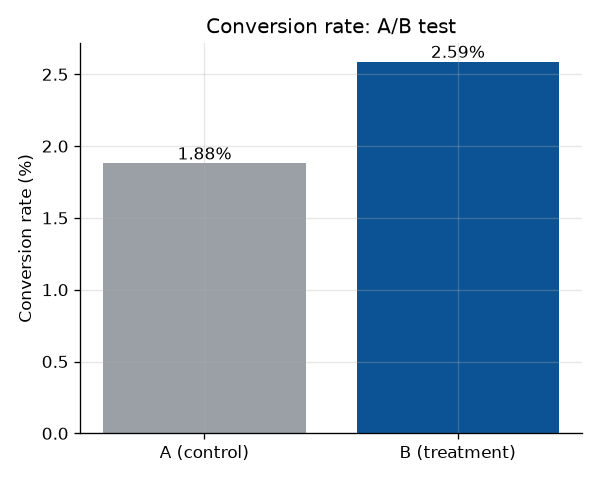
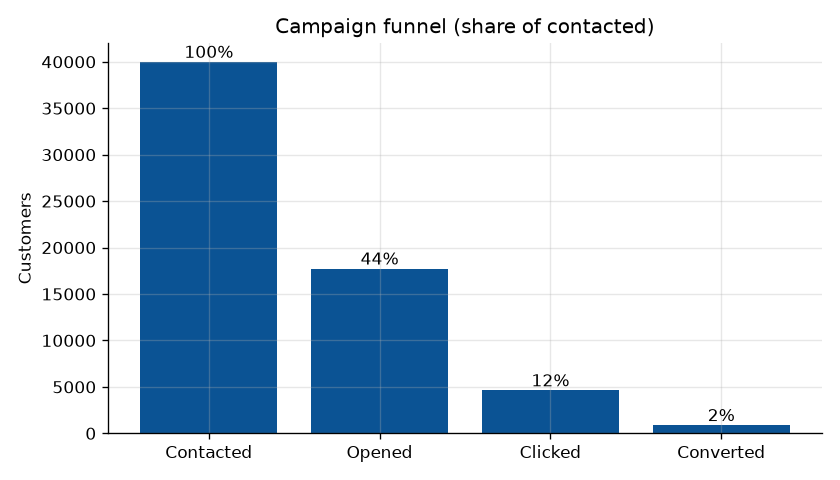
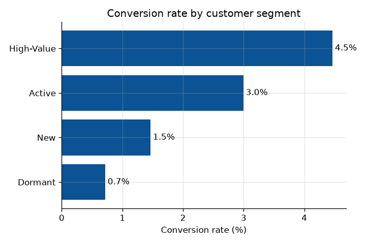
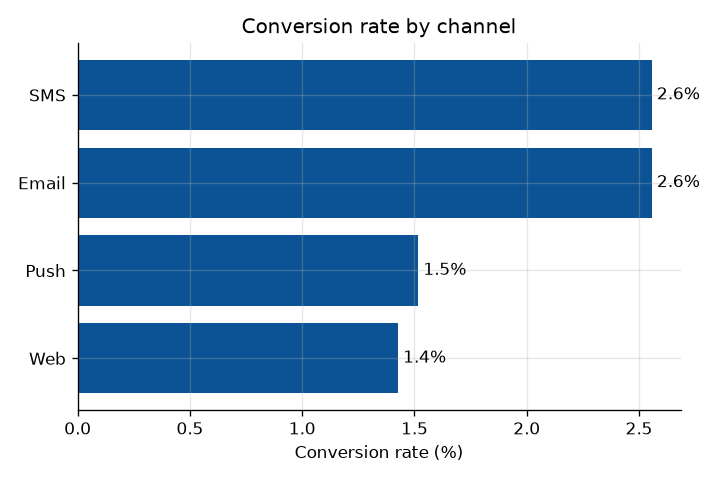

# Marketing Campaign Performance & A/B Analysis

End-to-end **campaign analytics** project: measure a multi-channel customer-engagement
campaign, run an **A/B test** on a personalised offer, and turn the results into
**actionable insights** and a **Looker Studio dashboard**. Built with **Python, SQL
(BigQuery), and data visualization** — the exact stack used in campaign / marketing
analytics roles.

> Data is synthetically generated with a fixed seed (`data/generate_dataset.py`) so every
> number below is fully reproducible. The schema mirrors a real CRM/campaign export:
> 40,000 contacted customers across 4 channels, 5 regions, and 4 customer segments,
> randomly split into a control group (A) and a personalised-offer group (B).

## Headline result

A two-proportion **z-test** shows the personalised offer (B) beat the control (A) with a
**statistically significant** lift:

| Group | Recipients | Conversions | Conversion rate | Revenue / recipient |
|---|--:|--:|--:|--:|
| A — control | 20,057 | 377 | **1.88%** | ₹57 |
| B — personalised offer | 19,943 | 516 | **2.59%** | ₹84 |

- **Relative lift: +37.7%** &nbsp;(absolute +0.71 pp, 95% CI [+0.42, +1.00] pp)
- **z = 4.79, p = 1.7e-06** — chi-square cross-check χ² = 22.6, p = 2.0e-06
- **Revenue per recipient +46.9%** → recommend **full roll-out of offer B**



## What the analysis answers

1. **Did B beat A, and is it significant?** → yes, p < 0.001 (see above).
2. **Where did the funnel leak?** contacted → opened (44%) → clicked (12%) → converted (2.2%).
3. **Who should we prioritise?** High-Value customers convert at **4.5%** and drive the most
   revenue per recipient — the prime **cross-sell / up-sell** audience.
4. **Where should budget go?** **SMS & Email** lead on conversion; Push & Web lag.
5. **Who needs a different play?** Dormant customers convert lowest (0.7%) — better suited to a
   **re-engagement / win-back** campaign than the standard offer.

| Funnel | By segment | By channel |
|---|---|---|
|  |  |  |

Full numbers: [`outputs/results_summary.md`](outputs/results_summary.md).

## Tech stack

| Layer | Tools |
|---|---|
| Data prep | Python (Pandas, NumPy) |
| Statistics | SciPy — two-proportion z-test, chi-square, 95% confidence intervals |
| Querying | SQL (BigQuery standard SQL) — `sql/` |
| Visualization | Matplotlib + Looker Studio dashboard |

## Repo structure

```
marketing-campaign-analytics/
├── data/
│   ├── generate_dataset.py        # reproducible synthetic CRM/campaign data (seed=42)
│   └── marketing_campaign.csv
├── sql/                           # BigQuery standard SQL
│   ├── 01_schema_and_load.sql
│   ├── 02_ab_test_lift.sql        # conversion, absolute/relative lift, revenue lift
│   ├── 03_funnel.sql              # open → click → convert, split by A/B
│   └── 04_segment_channel_region.sql
├── python/
│   ├── ab_test_analysis.py        # significance test + breakdowns → results_summary.md
│   └── eda_report.py              # charts → outputs/figures/
├── outputs/
│   ├── figures/                   # PNGs (mirror the dashboard)
│   └── results_summary.md
└── looker/looker_studio_setup.md  # build the dashboard (CSV or BigQuery)
```

## Reproduce

```bash
pip install -r requirements.txt
python data/generate_dataset.py     # writes data/marketing_campaign.csv
python python/eda_report.py          # writes outputs/figures/*.png
python python/ab_test_analysis.py    # writes outputs/results_summary.md
```

For the cloud version, load the CSV into BigQuery (`sql/01_schema_and_load.sql`), run the
queries in `sql/`, and connect Looker Studio — see [`looker/looker_studio_setup.md`](looker/looker_studio_setup.md).

## Key takeaways (business view)

- The personalised offer is a clear, significant win — **roll out B**.
- **Concentrate spend on High-Value + Active segments via SMS/Email** for the best return.
- **Re-engage Dormant customers** with a separate win-back track instead of the standard offer.

---
*Author: Ayush Singh · [github.com/AyushSingh03](https://github.com/AyushSingh03)*
